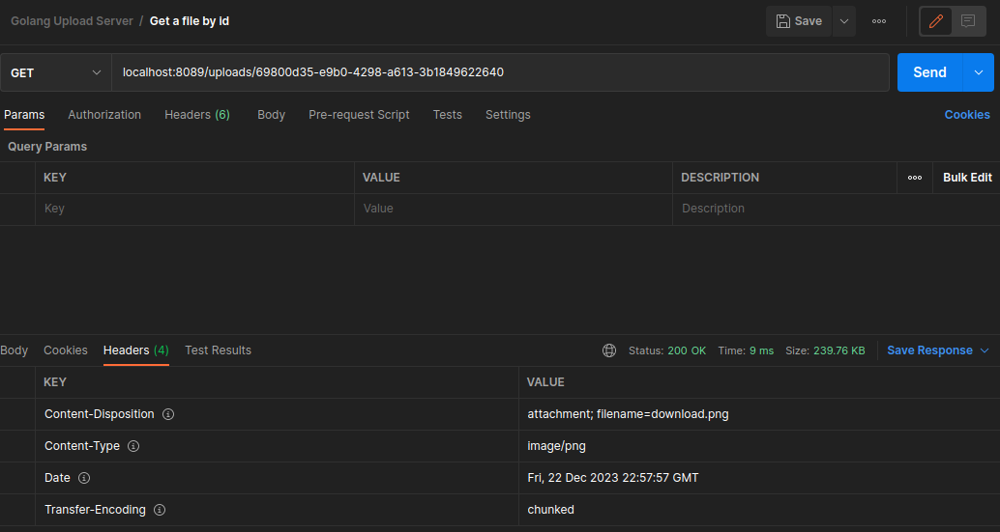

# Simple file uploader

I found the following interview exercise and I decided to give it a try

## Considerations
- I tried to use the least amount of external dependencies
- I tested on Ubuntu/Mac Os, not guaranteed that'll work on Windows
- By default, the upload folder is in `./../uploads` (I could've added a env variable or passing it by cli)

## How to run the App

I added a Makefile to make it simpler,

### Running the app
`make run`

### Removing binary and 'uploads' folder
`make clean`


## Endpoints
- Postman collection [here](Golang%20Upload%20Server.postman_collection.json)

### Get all files

Request
```shell
curl --location --request GET 'localhost:8089/uploads'
```

Response
```json
[
    {
        "id": "69800d35-e9b0-4298-a613-3b1849622640",
        "extension": ".png",
        "uploaded_at": "2023-12-22T19:55:13.513051066-03:00"
    },
    {
        "id": "2eb4433b-65d6-41e5-a956-46f9a7a2843e",
        "extension": ".png",
        "uploaded_at": "2023-12-22T19:55:14.412198521-03:00"
    },
    {
        "id": "411530ca-bdae-4afd-a35c-82968648d770",
        "extension": ".png",
        "uploaded_at": "2023-12-22T19:55:15.364256219-03:00"
    }
]
```

```
❯ tree
.
├── 2eb4433b-65d6-41e5-a956-46f9a7a2843e.png
├── 411530ca-bdae-4afd-a35c-82968648d770.png
└── 69800d35-e9b0-4298-a613-3b1849622640.png

```

### Upload a file

Request
```shell
curl --location --request POST 'localhost:8089/upload' \
--form 'file=@"/home/esteban/Pictures/Screenshot from 2023-10-04 19-24-17.png"'
```

Response
```json
{
    "message": "file uploaded successfully",
    "status": 201
}
```

### Get a file by its name

Request
```shell
curl --location --request GET 'localhost:8089/uploads/69800d35-e9b0-4298-a613-3b1849622640'
```

Responses

Ok


Wrong uuid
```json
{
  "message": "invalid uuid",
  "status": 400
}
```

Not found
```json
{
  "message": "id not found",
  "status": 404
}
```